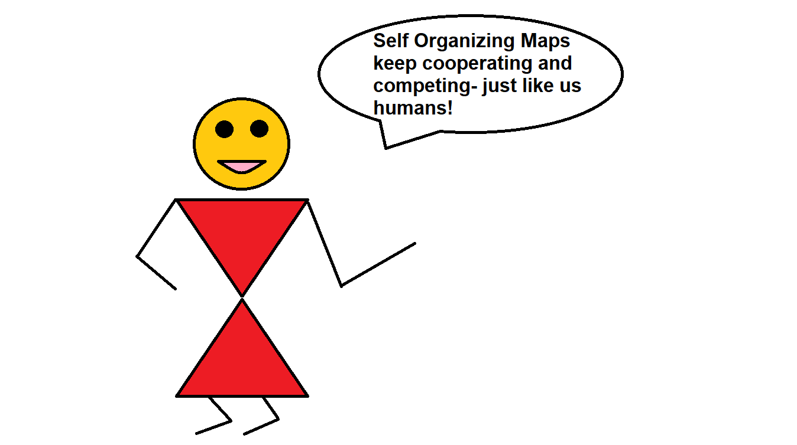

```{css, echo=FALSE}
.center {
   text-align: center;
}

```
---
<div class="center">
  <h1>Self Organizing Maps: An Applied Tutorial in R</h1>
  <h7>R Programming, FOSSEE Team</h7>
</div>

---

<div align="justify"> 

<B>Welcome to the guided tutorial on Self Organizing Maps in R, designed by the FOSSEE R Team at IIT Bombay in 2021.</B> 

<div class="center">

</div>


The purpose of this tutorial is to introduce students, professionals and researchers to the topic of Self Organizing Maps, a type of artificial neural network used for dimensionality reduction. This tutorial is designed for students of all ages and fields, without any prerequisites, however a fundamental understanding of neural networks is recommended. For understanding the basics of R programming you may refer to the spoken tutorial on R [here](https://spoken-tutorial.org/tutorial-search/?search_foss=R&search_language=English).
This tutorial is divided into 3 modules, which will introduce the subject in an incremental manner. You may utilize the modules in any order, depending on your pace. 

<BR>

## Learning Modules
<BR>

- [Module 1: Introduction to Self Organizing Maps](module1.html)
- [Module 2: Solved Example of Self Organizing Maps: Iris Dataset](module2.html)
- [Module 3: Application of SOMs in Real Life: Modelling the COVID-19 Pandemic in India](module3.html)


<BR>

If you wish to contribute to this open source work, or provide your suggestions to the existing work, please reach out to contact-r(at)fossee(dot)in.

</div>