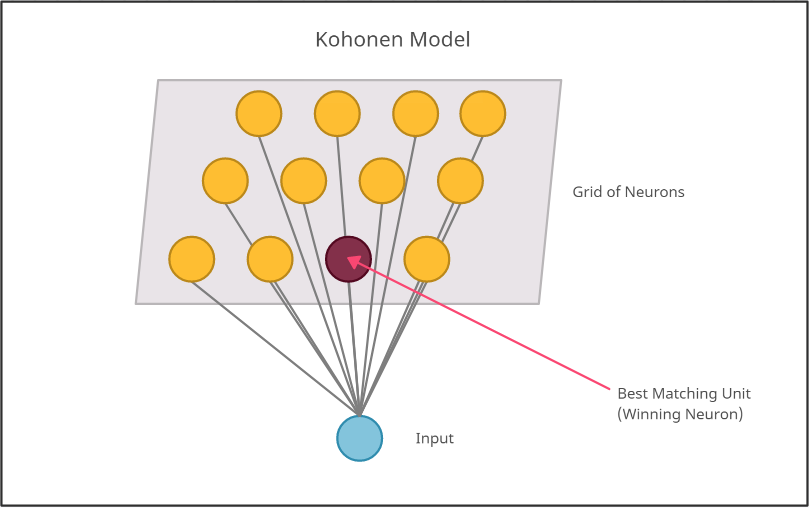
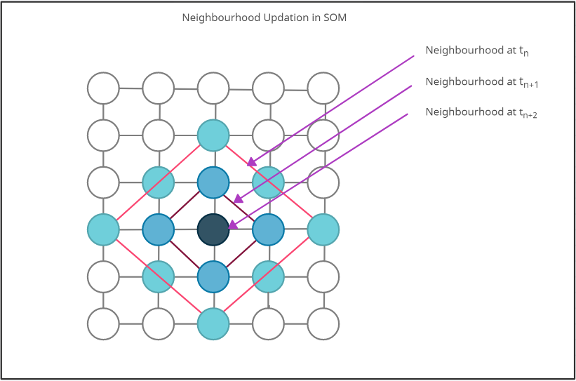

```{r setup, include=FALSE}
knitr::opts_chunk$set(echo = TRUE)
```
[Return To Home Page](Start_here.html)

```{css, echo=FALSE}
.center {
   text-align: center;
}

```

---

<div class="center">
  <h1>Module 1</h1>
  <h3>Introduction to Self Organizing Maps</h3>
</div>


---


```{R echo=TRUE, message=FALSE, warning=FALSE, include=FALSE}
#install.packages("tinytex")
#install.packages('rmarkdown')
#devtools::install_github('yihui/tinytex')
#tinytex::install_tinytex()
#library(tinytex)
#install.packages("DiagrammeR")
library(DiagrammeR)
#install.packages("diagram")
library(diagram)


```
# Table of Contents 

  - <a href="#lession1">Chapter 1: Introduction to SOM</a><br />
  - <a href="#lession2">Chapter 2: Algorithm</a><br />
  - <a href="#lession3">Chapter 3: Guided Tutorial in R</a><br />
  -- <a href="#t1">3.1: Initialization</a><br />
  -- <a href="#t2">3.2: Sampling</a><br />
  -- <a href="#t3">3.3: Competition</a><br />
  -- <a href="#t4">3.4: Cooperation</a><br />
  -- <a href="#t5">3.5: Adaptation</a><br />
  - <a href="#lession4">Chapter 4: Implementation</a><br />
    -- <a href="#t1">4.1: Data Generation</a><br />
  -- <a href="#t2">4.2: Initialization</a><br />
  -- <a href="#t3">4.3: Best Matching Unit</a><br />
  -- <a href="#t4">4.4:Training the SOM</a><br />
  - <a href="#lession5">Chapter 5: Optimization in R</a><br />
  - <a href="#lession6">Chapter 6: Running the model over multiple epochs </a><br />
  - <a href="#lession7">Chapter 7: References</a><br />
    
    
    
<a id="lession1"></a>

## Chapter 1: Introduction to SOM 
<div align="justify"> 

Self organizing maps are a type of artificial neural network based on competitive learning that work by reducing the number of dimensions from a high dimensional space to a 2 D map.  Once the data is fed to the system, a grid of artificial neurons is trained by providing information about inputs. Neurons compete to be the weight vector of the unit is closest to the current object, which is also called the winning or active unit. During the training stage, the values for the input variables are gradually adjusted in an attempt to preserve neighborhood relationships that exist within the input data set. As it gets closer to the input object, the weights of the winning unit are adjusted as well as its neighbors.[@a1] With every training iteration, the neighbourhood of the BMU gets smaller and the learning rate decays as the weights slowly converge to form a map that represents the input space. The self organizing map provides this representation as the result of training which can be used to understand the data better with the reduced dimensionality.[@a2,@a3]

<div class="center">



</div>  

#### Competitive Learning
The model utilizes using unsupervised learning to map the input through competitive learning in which the output neurons compete amongst themselves to be activated, with the result that only one is activated at any one time. Getting the Best Matching Unit is done by running through all weight vectors and calculating the distance from each weight to the sample vector. The weight with the shortest distance from the input is the winner. There are numerous ways to determine the distance, however, the most commonly used method is the Euclidean Distance and/or Cosine Distance.In this tutorial, the Euclidean distance has been used. Due to the negative feedback connections between the neurons,  the neurons are forced to organise themselves which gave rise to the name Self Organizing Map (SOM). [@a4,@a5,@a6,@a7,@a8,@a9]

<div class="center">

</div>  

<a id="lession2"></a>

## Chapter 2: Algorithm

```{R echo=TRUE, fig.width=25, fig.height=40, message=FALSE, warning=FALSE , include=FALSE}
library(DiagrammeR)
library(diagram)

png("flowchart.png", width = 500, height = 1200)
openplotmat(main = "")
 rx <- 0.3
 ry <- 0.03
pos <- coordinates(c(1,1,1,1,1,1,1,1 ), mx = -0.00001)
fromto <- matrix(ncol = 2, byrow = TRUE,  data = c(1, 2, 2, 3, 3,4,4,5,5,6,6,7,7,8))
nr <- nrow(fromto)

arrpos <- matrix(ncol = 2, nrow = nr) 
for (i in 1:nr)
{arrpos[i, ] <- straightarrow (to = pos[fromto[i, 2], ],
from = pos[fromto[i, 1], ],
lwd = 2, arr.pos = 0.6, arr.length = 0.5)
}
curvedarrow (from = pos[6, ], to = pos[3, ],lwd = 2, lty = 1)
textround(mid = pos[1,], radx = rx, rady = ry, lab = "Start", cex = 2, shadow.col = "black")
textdiamond(mid = pos[2,], radx = rx, rady = ry, lab = "Initialization", cex = 2, shadow.col = "lightblue")
textrect(mid = pos[3,], radx = rx, rady = ry, lab = "Sampling", cex = 2, shadow.col = "darkred")
textrect(mid = pos[4,], radx = rx, rady = ry, lab = "Competition", cex = 2, shadow.col = "darkred")
textrect(mid = pos[5,], radx = rx, rady = ry, lab = "Cooperation", cex = 2, shadow.col = "darkred")
textrect(mid = pos[6,], radx = rx, rady = ry, lab = "Adaptation", cex = 2, shadow.col = "darkred")
textrect(mid = pos[7,], radx = rx, rady = ry, lab = "Convergence", cex = 2, shadow.col = "darkred")
textround(mid = pos[8,], radx = rx, rady = ry, lab = "End", cex = 2, shadow.col = "black")

dev.off()

```

<div class="center">

</div>
### Steps: 

- Initialization - Create a grid of neurons and randomly initialize weights.
- Sampling- Select a random row (vector) from input data.
- Competition- Neurons fight to become the Best Matching Unit which is determined using the discriminant function.
- Cooperation- The winning neuron determines the spatial location of a topological neighbourhood of excited neurons which will cooperate.
- Adaptation- Weights are adjusted with respect to winning neuron, such that a similar input pattern is enhanced.
- We will go back to step 2 and keep repeating the process till the map stops changing or convergence is achieved.

<a id="lession3"></a>

## Chapter 3: Guided Tutorial in R


<a id="t1"></a>

### 3.1: Initialization 

Create a grid of neurons and randomly initialize weights. The neurons are represented by weight vectors of same dimensions as input. The random numbers are generated using the rnorm function which generates  random numbers in the range -1 to 1.

Code snippet:


```{R echo=TRUE, message=FALSE, warning=FALSE}
#3.1.1) Creating a matrix of 10 rows and 5 columns.
t <- matrix(data = rnorm(50),  nrow = (10), ncol = 5)
t
```

<a id="t2"></a>

### 3.2:  Sampling

Select a random row (vector) from input data. The sampling is done using the sample() function in R which retrieves an input row.


```{R echo=TRUE, message=FALSE, warning=FALSE}
#3.2.1) Sampling a random row from matrix t.
i <- sample(t, 1, replace = F)
i
```

<a id="t3"></a>

### 3.3:  Competition

Neurons fight to become the Best Matching Unit which is determined using the discriminant function.Here our discriminant function is Euclidean distance given by the formula:


<body>
\begin{equation}
 d\left( x,y\right) = \sqrt {\sum _{i=1}^{n}  \left( y_{i}- x_{i}\right)^2 } 
 \end{equation}
 <center> Euclidean distance formula</center><br><br><br><br>
 where $x$ and $y$ are the two points in n dimensional space  and $x_{i}$ and $y_{i}$ are the vectors representing their positions between which the Euclidean distance is to be calculated.

</body>


```{R echo=TRUE, message=FALSE, warning=FALSE}

#3.3.1) Creating a function to calculate euclidean distance.
euclidean_distance <- function(x, y) {
  ret <- sum((x - y)^2)
  return(ret)
}

#3.3.2) Let's run this on a sample input.

euclidean_distance(2,4)
```


The Best Matching Unit is the neuron which is closest to the input vector. The discriminant function is used to calculate this distance between all the neurons' weights and the input vector.

<div class="center">

</div>


```{R echo=TRUE, message=FALSE, warning=FALSE}

#3.3.3) Defining the BMU function with parameters where x is a single input row of data and input_grid is the grid.
BMU <- function(x, input_grid) { 
  distance <- 0
  min_distance <- 10000000 
  min_ind <- -1 
   #3.3.3.1) Iterating through grid.
  for (e in 1:nrow(input_grid))
  {
    #3.3.3.2) Euclidean_distance distance calculation.
    distance <- euclidean_distance(x, input_grid[e, ]) 
    if (distance < min_distance) {
      #3.3.3.3) Updating min distance for winning unit.
      min_distance <- distance 
      #3.3.3.4) Updating winning neuron.
      min_ind <- e 
    }
  }
  #3.3.3.5) Returns index of BMU.
  return(min_ind-1) 
}
```


<a id="t4"></a>

### 3.4:  Cooperation

The winning neuron determines the spatial location of a topological neighbourhood of excited neurons which will cooperate.


<body>
\begin{equation}
 influence = exp(-(distance^{2}) / (2 * (radius^{2}))) 
 \end{equation}
  <center> Neighbourhood influence calculation formula</center><br><br>
 where $distance$ is the lateral distance between neurons in the grid and  $radius$ is the radius of the neighbourhood over which influence is to be calculated.

</body>

```{R echo=TRUE, message=FALSE, warning=FALSE}
#3.4.1) Defining a function to calculate the neighbourhood influence using the radius of neighbourhood and lateral distance.
influence_calculation <- function(distance, radius) {
  ret <- exp(-(distance^2) / (2 * (radius^2)))
  return(ret)
}

#3.4.2) Calculating sample neighbourhood for lateral distance 2 and radius 4.
influence_calculation(2,4)
```

<a id="t5"></a>

### 3.5:  Adaptation

Weights are adjusted with respect to winning neuron, such that a similar input pattern is enhanced.


<body>
\begin{equation}
 new\_radius = radius * exp(-current\_iteration / time\_constant) 
 \end{equation}
 
  <center> Radius decay formula</center><br><br>
 where $radius$ is the initial radius of neighbourhood, $current\_iteration$ is the iteration of data sampling that we are currently on and  $time\_constant$ is the time constant which is incremented at each iteration, when the SOM gets updated.

 <\body>
 
 
```{R echo=TRUE, message=FALSE, warning=FALSE}

#3.5.1) Function for the decaying radius for a given iteration current_iteration.
decay_radius_function <- function(radius, current_iteration, time_constant) {
  ret <- radius * exp(-current_iteration / time_constant)
  return(ret)
}

#3.5.2) Calculate radius of neighborhood at a iteration 4, with radius 3 and at the 4th iteration.
decay_radius_function(3,4,4)

```

 <body>
 \begin{equation}
 new\_lateral\_distance = learning\_rate * exp(-current\_iteration / n\_iteration)
 \end{equation}
  <center> Learning rate decay formula</center><br><br>
 where $learning\_rate$ is the old learning rate to be updated, $current\_iteration$ is the iteration of data sampling that we are currently on  and  $n\_iteration$ is the total number of iterations the SOM is trained over.

</body>


```{R echo=TRUE, message=FALSE, warning=FALSE}

#3.5.3) Function for the decaying learning rate.
decay_learning_rate <- function(learning_rate, current_iteration, n_iteration) {
  ret <- learning_rate * exp(-current_iteration / n_iteration)
  return(ret)
}

#3.5.4) Calculating the learning rate of model at the 3rd iteration out of a total of 100 iterations and initial learning rate of 0.1.
decay_learning_rate(0.1,3,100)

```


<a id="lession4"></a>

## Chapter 4:  Implementation

<a id="e1"></a>

### 4.1: Data Generation

For this tutorial, we will demonstrate the working of SOM on a given dataset of 3 dimensions. We will load this dataset from the working directory. We will also import the necessary libraries.

<B>Code Snippet</B>

```{R echo=TRUE, message=FALSE, warning=FALSE}

set.seed(222)
library(dplyr)

# 4.1.1) Reading the data and scaling it.
data <- read.csv("binary.csv", header = T)
X <- scale(data[, -1])
data <- X
```

<a id="e2"></a>


### 4.2: Initialization

The SOM is in its essence a grid of neurons, each neuron containing a weight vector and a position i,j in the grid. We begin by assigning random values for the initial weight vectors w. The dimensions of the weight vector are equal to the number of input dimensions.


<div class="center">

</div> 

<B>Code Snippet</B>

```{R echo=TRUE, message=FALSE, warning=FALSE}

#4.2.1) Now lets initialize the weights of the neural network.Creating a 4x4 neural network with 3 dimensions to match the input.

# -----------------------------------------------------
# This is Step 1 of the Algorithm: Initialization
# -----------------------------------------------------

create_grid <- function(n,p) {
  ret <- matrix(data = rnorm(n * p), nrow = n, ncol = p)
  return(ret)
}
grid <- create_grid(9,3)
grid
```


<a id="e3"></a>

### 4.3: Best Matching Unit 

The SOM works using competitive learning which selects a best matching unit at each iteration using the discriminant function value closest to the randomly sampled input vector. 


<B>Code Snippet</B>

```{R echo=TRUE, message=FALSE, warning=FALSE}

# -----------------------------------------------------
# This is Step 3 of the Algorithm: Competition
# -----------------------------------------------------

# 4.3.1) Using the euclidean_distance function for finding BMU.
euclidean_distance <- function(x, y) {
  ret <- sum((x - y)^2)
  return(ret)
}

# 4.3.2) BMU Function to return winning neuron.
BMU <- function(x, input_grid) { 
  distance <- 0
  min_distance <- 10000000 
  min_ind <- -1 
   #4.3.3) Iterating through grid.
  for (e in 1:nrow(input_grid))
  {
    #4.3.4) Euclidean_distance distance calculation.
    distance <- euclidean_distance(x, input_grid[e, ]) 
    if (distance < min_distance) {
      #4.3.5) Updating min distance for winning unit.
      min_distance <- distance 
      #4.3.6) Updating winning neuron.
      min_ind <- e 
    }
  }
  #4.3.7) Returns index of BMU.
  return(min_ind-1) 
}

```

<a id="e4">  </a>


### 4.4: Training the SOM.

The SOM follows the algorithm mentioned above to fit the training data till the map stops changing or in other words till the model converges. 

<B>Code Snippet</B>

```{R echo=TRUE, message=FALSE, warning=FALSE}

# -----------------------------------------------------
# This is Step 5 of the Algorithm: Adaptation
# -----------------------------------------------------

# 4.4.1) Decaying radius function.
decay_radius_function <- function(radius, current_iteration, time_constant) {
  ret <- radius * exp(-current_iteration / time_constant)
  return(ret)

}

# -----------------------------------------------------
# This is Step 4 of the Algorithm: Cooperation
# -----------------------------------------------------


# 4.4.2) Decaying learning rate.
decay_learning_rate <- function(learning_rate, current_iteration, n_iteration) {
  ret <- learning_rate * exp(-current_iteration / n_iteration)
  return(ret)
}

# 4.4.3) A function to calculate influence over neighboring neurons.
influence_calculation <- function(distance, radius) {
  ret <- exp(-(distance^2) / (2 * (radius^2)))
  return(ret)
}


# 4.4.4) Creating a function to implement SOM traiining.
SOM <- function(x, input_grid) {
  
   #4.4.5) Defining the training parameters.
   #4.4.6) Defining number of iterations.
   n_iteration <- 400 
   #4.4.7)Defining initial learning rate.
  initial_learning_rate <- 0.05 
  # 4.4.8) Defining initial radius.
  initial_radius <- 3 
  # 4.4.9)Initializing time constant.
  time_constant <- n_iteration / log(initial_radius) 
  # 4.4.10) Initialising physical locations of neurons to figure out lateral distance.
  lateral_distance_points=expand.grid(1:sqrt(nrow(input_grid)),1:sqrt(nrow(input_grid)))
  # 4.4.11) The square grid is used here - so taking the number of rows as square root of number of entries in the grid.
  rows=sqrt(nrow(input_grid)) 
  #4.4.12) Defining the number of epochs.
  n_epochs=10 
  for(ne in 1:n_epochs)
  {
    print(ne)
    old_grid=input_grid
    #  4.4.13)Looping through for training.
    for (i in 1:n_iteration) 
    {
      #4.4.14) Selecting random input row from given data set.
      sample_input_row <- as.vector(unlist(x[sample(1:nrow(x), size = 1, replace = F), ])) 
      #4.4.15) Decaying radius.
      new_radius <- decay_radius_function(initial_radius, i, time_constant) 
      #4.4.16) Decaying learning rate.
      new_learning_rate <- max(decay_learning_rate(initial_learning_rate, i, n_iteration), 0.01) 
       #4.4.17) Finding best matching unit for given input row.
      index_temp <- BMU(sample_input_row, input_grid)
      #4.4.18)Converting a 1D co-ordinate to a 2D co-ordinate for finding lateral distance on the map.
      index_new=c((as.integer(index_temp/rows))+1,(index_temp%%rows)+1) 
      #4.4.19)Finding Euclidean distance between the given best matching units and all units on the map.
      lateral_distance=sqrt(rowSums(sweep(lateral_distance_points,2,index_new)^2)) 
       #4.4.20)Finding neurons that are within the radius of the winning unit.
      rn=which(lateral_distance<=new_radius)
      #4.4.21)Calculating the influence of the winning neuron on neighbours.
      inf=influence_calculation(lateral_distance[rn],new_radius) 
      #4.4.22)A temporary matrix that stores the difference between the data point and the weights of the winning neuron & neighbours.
      diff_grid=(sweep(input_grid[rn,],2,sample_input_row))*-1
      #4.4.23)The updating operation on the winning and neighbouring neurons.
      updated_weights=new_learning_rate*inf*diff_grid 
       #4.4.24)Now updating those grid entries that are either the winning neuron or its neighbours.
      input_grid[rn,]=input_grid[rn,]+updated_weights
      if(isTRUE(all.equal(old_grid,input_grid)))
      {
        print(i)
        print("Converged")
      }
    }
  }
  #4.4.25)Returning the updated SOM weights.
  return(input_grid) 
}
#4.4.26) Timing the algorithm to find training time.
start <- Sys.time()
gridSOM=SOM(data,grid)
end <- Sys.time()
gridSOM

time_taken <- end - start
print(time_taken)

```


```{R echo=TRUE, message=FALSE, warning=FALSE}

library(photobiology)
drawGrid<- function(weight,dimension){
  
  weight<-as.matrix(weight, ncol = ncol(weight))
  
  norm.matrix<-NULL
  

  for(i in 1:length(weight[,1])){
    a<-norm(weight[i,], type = "2")
    norm.matrix<-rbind(norm.matrix,a)
  }
  
  #4.4.27)s Mapping to range 400 to 700.
  input_start<-min(norm.matrix)
  input_end<-max(norm.matrix)
  output_start<-400
  output_end<-700
  
  
  #4.4.28) Calculating wavelength based on norm.
  color<-NULL
  for(i in 1:length(norm.matrix)){
    input = norm.matrix[i]
    output = output_start + ((output_end - output_start) / (input_end - input_start)) * (input - input_start)
    color<-rbind(color,output)
  }
  
  #4.4.29) Getting the colors (hex values) from the wavelength.
  color.rgb<-w_length2rgb(color)
  
  
  #4.4.30) Plotting the grid.
  dim<-max(dimension)+1
  plot(1:dim, type = "n")
  
  for (i in 1:dimension[1]) {
    for(j in 1:dimension[2]){
      rect(i,j,i+1,j+1, col = color.rgb[i*dimension[1]+j - dimension[1]])
    }
  }
} 
gridSOM=matrix(unlist(gridSOM),ncol=3)
drawGrid(gridSOM,c(3,3))

```

<a id="lession5"></a>

## Chapter 5: Optimization in R

If you wish to explore further optimization of the SOM code, try running the below code cells and compare the running time of two approaches. The method of optimization here is vectorization.

```{R echo=TRUE, message=FALSE, warning=FALSE}
BMU_Vectorised <- function(x, input_grid) { 
  #5.1) Calculating the distance of this row from all the neurons using matrix operations.
  dist_mtrx=rowSums(sweep(input_grid,2,x)^2) 
  #5.2) Finding the location of the neuron with the minimum distance.
  min_ind=which.min(dist_mtrx)
  #5.3) Returning the zero-indexed value of the winning neuron.
  return (min_ind-1) 
}
```

```{R echo=TRUE, message=FALSE, warning=FALSE}

#5.4) Fastest BMU Implementation using vectorisation.

SOM <- function(x, input_grid) {
  
   n_iteration <- 400 
  initial_learning_rate <- 0.05 
  initial_radius <- 3 
  time_constant <- n_iteration / log(initial_radius) 
  lateral_distance_points=expand.grid(1:sqrt(nrow(input_grid)),1:sqrt(nrow(input_grid)))
  rows=sqrt(nrow(input_grid)) 
  n_epochs=10 
  for(ne in 1:n_epochs)
  {
    print(ne)
    old_grid=input_grid
    for (i in 1:n_iteration) 
    {
      sample_input_row <- as.vector(unlist(x[sample(1:nrow(x), size = 1, replace = F), ])) 
      new_radius <- decay_radius_function(initial_radius, i, time_constant) 
      new_learning_rate <- max(decay_learning_rate(initial_learning_rate, i, n_iteration), 0.01) 
      index_temp <- BMU_Vectorised(sample_input_row, input_grid)
      index_new=c((as.integer(index_temp/rows))+1,(index_temp%%rows)+1) 
      lateral_distance=sqrt(rowSums(sweep(lateral_distance_points,2,index_new)^2))
      rn=which(lateral_distance<=new_radius) 
      inf=influence_calculation(lateral_distance[rn],new_radius) 
      diff_grid=(sweep(input_grid[rn,],2,sample_input_row))*-1 
      updated_weights=new_learning_rate*inf*diff_grid 
      input_grid[rn,]=input_grid[rn,]+updated_weights 
      if(isTRUE(all.equal(old_grid,input_grid)))
      {
        print(i)
        print("Converged")
      }
    }
  }
  return(input_grid) 
}
start <- Sys.time()
gridSOM=SOM(data,grid)
end <- Sys.time()
gridSOM


time_taken <- end - start
print(time_taken)

```

<a id="lession6"></a>

### Chapter 6: Running the model over multiple epochs.
```{R echo=TRUE, message=FALSE, warning=FALSE}

#6.1) Training the model over multiple epochs and observing the iteration of convergence.
SOM <- function(x, input_grid) {
  breaker <- 0
  n_iteration <- nrow(x) 
  initial_learning_rate <- 0.05 
  initial_radius <- 3 
  time_constant <- n_iteration / log(initial_radius)
  lateral_distance_points=expand.grid(1:sqrt(nrow(input_grid)),1:sqrt(nrow(input_grid)))
  rows=sqrt(nrow(input_grid))
  n_epochs=40 
  new_radius <- initial_radius
  l <- c()
  for(ne in 1:n_epochs)
  {
    extra <- ((ne-1)*400)
    for (i in 1:n_iteration)
    {
      old_grid=input_grid
      curr_i <- extra + i
      sample_input_row <- as.vector(unlist(x[sample(1:nrow(x), size = 1, replace = F), ])) 
      new_radius <- decay_radius_function(initial_radius, curr_i, time_constant) 
      new_learning_rate <- decay_learning_rate(initial_learning_rate,curr_i, n_iteration)
      index_temp <- BMU_Vectorised(sample_input_row, input_grid) 
      index_new=c((as.integer(index_temp/rows)+1),(index_temp%%rows)+1) 
      lateral_distance=sqrt(abs(rowSums(sweep(lateral_distance_points,2,index_new)^2))) 
      rn=which(lateral_distance<=new_radius) 
      inf=influence_calculation(lateral_distance[rn],new_radius)
      if(length(rn)!=1) 
      {
        diff_grid=(sweep(input_grid[rn,],2,sample_input_row))*-1 
        updated_weights=new_learning_rate*inf*diff_grid
        input_grid[rn,]=input_grid[rn,]+updated_weights 
      }
      else 
      {
        diff_row=(input_grid[rn,]-sample_input_row)*-1 
        updated_weights=new_learning_rate*inf*diff_row 
        input_grid[rn,]=input_grid[rn,]+updated_weights 
      }
      l <- c(l,euclidean_distance(old_grid,input_grid))
      if(isTRUE(all.equal(old_grid,input_grid)))
      {
        print(curr_i)
        print("Converged")
        breaker <- 1
        break
      }
    }
    if(breaker ==1)
    {
      break
    }
  }
  return(list(input_grid,l)) 
}
y <- SOM(data,grid)

gridSOM <- y[1]
gridSOM
l <- y[2]

t=1:length(l[[1]])
plot(t,l[[1]])
```

The above plot shows the decay in learning rate in a visual format. The points on the graph represent the difference between the weights of the neural network in consecutive iterations of training. Thus the downwards curve represents a decay in rapidness with which the SOM updates its weights, or in visual terms adjusts itself to map the input space. As the training of the SOM progresses, the neighbourhood radii decrease and the map fixates on finer details, but has learnt a majority of the representation and does not move rapidly. Initially the map has a steep curve which indicates that it is initially learning rapidly.


## Conclusion

Thus we have successfully implemented Self Organizing Maps in R and have visualized the training progress, results on Admissions data and also have optimized the slower R implementation. Using vectorization has sped up the calculations which were done using loops and this results in a great decrease in training time. Using Self Organizing Maps for creating a representation of the Admissions data helped us understand the nature of data and the grid of colours shows 3-4 clusters present.

</div>

<BR><BR>


<a id="lession7"> </a>

## Chapter 7: References