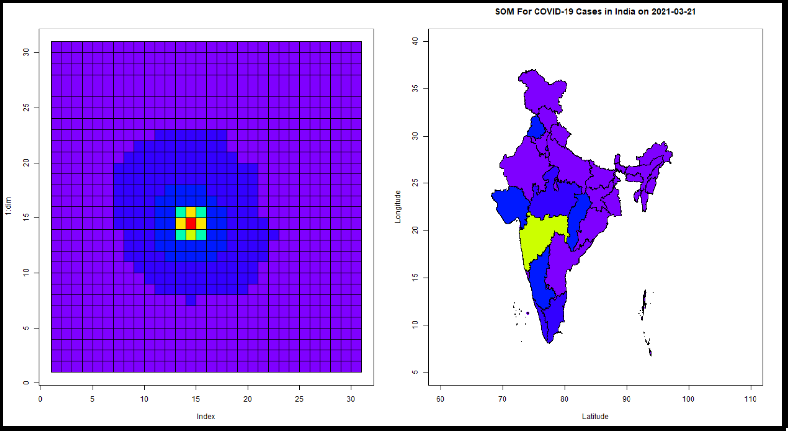

```{r setup, include=FALSE}
knitr::opts_chunk$set(echo = TRUE)
```

[Return To Home Page](Start_here.html)

```{css, echo=FALSE}
.center {
   text-align: center;
}

```

---
<div class="center">
  <h1>Module 3</h1>
  <h3>Application of SOMs in Real Life: Modelling the COVID-19 Pandemic in India</h3>
</div>

---

<div align="justify"> 

The COVID-19 pandemic has had a devastating impact across the world in the years 2020 and 2021. In an attempt to study the dynamics of the pandemic we need to analyze the number of rising cases and deaths and find patterns in the trends of the pandemic impact. But the sheer amount of data available on the pandemic makes this task difficult, as the voluminous numbers need to be reduced to concise insights for usage in real life. Out of the many approaches to dimensionality reduction, we show an implementation of self organizing maps on the COVID-19 data for India. We also present the patterns visually in the form of dynamic Self Organizing Map charts and their spatial representation using the India map. The data used in this implementation ranges from 1st March 2021 to 1st June 2021 and contains data on all the states in India as of 2021. The data has been sourced from [@c1],[@c2],[@c3].


<div class="center">

</div>


<a id="aa1"></a>

## Part 1: Loading and installing necessary libraries.

```{R echo=TRUE, fig.width=25, fig.height=40, message=FALSE, warning=FALSE }

#1.1) Installing and loading the necessary libraries.
 # install.packages("readr")
 # install.packages("dplyr")
 # install.packages("rgdal")
 # install.packages("sf")
 # install.packages("ggplot2")
 # install.packages("magick")

suppressWarnings(library(readr))
suppressWarnings(library(dplyr))
suppressWarnings(library(rgdal))
suppressWarnings(library(sf))
suppressWarnings(library(ggplot2))
suppressWarnings(library(magick))
```

<a id="aa2"></a>


## Part 2: Creating the functions necessary for working of SOMs. Refer to Module 1 for learning about the same.

```{R echo=TRUE, fig.width=25, fig.height=40, message=FALSE, warning=FALSE }

#-----------------------------------------------------------------------------------------------------------------------------------------------------------------

# 2.1) A function to return the sum of squared distance between x and y.

euclidean_distance <- function(x, y) {
  ret <- sqrt(sum((x - y)^2))
  return(ret)
}

#-----------------------------------------------------------------------------------------------------------------------------------------------------------------

# 2.2) Function to create a SOM grid.
# x*y is the number of neurons.
# p is the number of columns in the original dataframe or number of input dimensions.
# data table is used for faster computation.

create_grid <- function(x,y,p) {
  ret <- matrix(data = rnorm(x * y * p), nrow = x * y, ncol = p)
  return(ret)
}


#-----------------------------------------------------------------------------------------------------------------------------------------------------------------

# 2.3) Function to decay the radius exponentially over time. 
# radius is the initial radius that is passed.
# current_iteration represents the current iteration.
# time_constant is the time constant.

decay_radius_function <- function(radius, current_iteration, time_constant) {
  ret <- radius * exp(-current_iteration / time_constant)
  return(ret)
}

#-----------------------------------------------------------------------------------------------------------------------------------------------------------------

# 2.4) Function to decay the learning rate.
# learning_rate is the current learning rate.
# current_iteration is the current iteration.
# n_iteration is the number of iterations.

decay_learning_rate <- function(learning_rate, current_iteration, n_iteration) {
  ret <- learning_rate * exp(-current_iteration / n_iteration)
  return(ret)
}

#-----------------------------------------------------------------------------------------------------------------------------------------------------------------

# 2.5) A function to calculate influence over neighboring neurons.
#distance is the lateral distance.
#radius is the current neighbourhood radius.

influence_calculation <- function(distance, radius) {
  ret <- exp(-(distance^2) / (2 * (radius^2)))
  return(ret)
}


#-----------------------------------------------------------------------------------------------------------------------------------------------------------------

# 2.6) A function to return the winning neuron.
# x is a single row of data and input_grid is the grid.

BMU <- function(x, input_grid) { 
  distance <- 0
  min_distance <- 10000000 
  min_ind <- -1 
  for (e in 1:nrow(input_grid)) # Iterating through grid
  {
    distance <- euclidean_distance(x, input_grid[e, ]) # Calculating euclidean_distance distance.
    if (distance < min_distance) {
      min_distance <- distance # Updating min distance for winning unit.
      min_ind <- e # Updating winning neuron.
    }
  }
  return(min_ind-1) #Returns index of BMU.
}

#-----------------------------------------------------------------------------------------------------------------------------------------------------------------

#2.7) Fastest BMU Implementation using vectorisation. You can opt in for this function over the regular BMU function for faster execution.


BMU_Vectorised <- function(x, input_grid) { 
  dist_mtrx=rowSums(sweep(input_grid,2,x)^2) #Calculating the distance of this row from all the neurons using matrix operations.
  min_ind=which.min(dist_mtrx) #Finding the location of the neuron with the minimum distance.
  return (min_ind-1) #Returning the zero-indexed value of the winning neuron.
}


#-----------------------------------------------------------------------------------------------------------------------------------------------------------------

#2.8) A function to encapulate the entire creation, working and updating of SOM over the training period.
#x is the input and input_grid is the SOM grid that will be updated iteratively.

SOM <- function(x, input_grid) {
  breaker <- 0
  n_iteration <- nrow(x) # Defining number of iterations.
  initial_learning_rate <- 0.5 # Defining initial learning rate.
  initial_radius <- 15 # Defining initial radius.
  time_constant <- n_iteration / log(initial_radius) # Initializing time constant.
  lateral_distance_points=expand.grid(1:sqrt(nrow(input_grid)),1:sqrt(nrow(input_grid)))#Initialising physical locations of neurons to figure out lateral distance.
  rows=sqrt(nrow(input_grid)) #The square grid is used here - so taking the number of rows as square root of number of entries in the grid.
  n_epochs=40 #Defining the number of epochs.
  new_radius <- initial_radius
  l <- c()
  for(ne in 1:n_epochs)
  {
    extra <- ((ne-1)*400)
    for (i in 1:n_iteration) # Looping through for training.
    {
      old_grid=input_grid
      curr_i <- extra + i
      sample_input_row <- as.vector(unlist(x[sample(1:nrow(x), size = 1, replace = F), ])) # Selecting random input row from given data set.
      new_radius <- decay_radius_function(initial_radius, curr_i, time_constant) # Decaying radius.
      new_learning_rate <- decay_learning_rate(initial_learning_rate,curr_i, n_iteration) # Decaying learning rate.
      index_temp <- BMU_Vectorised(sample_input_row, input_grid) # Finding best matching unit for given input row.
      index_new=c((as.integer(index_temp/rows)+1),(index_temp%%rows)+1) #Converting a 1D co-ordinate to a 2D co-ordinate for finding lateral distance on the map.
      lateral_distance=sqrt(abs(rowSums(sweep(lateral_distance_points,2,index_new)^2))) #Finding Euclidean distance between the given best matching units and all units on the map.
      rn=which(lateral_distance<=new_radius) #Finding neurons that are within the radius of the winning unit.
      inf=influence_calculation(lateral_distance[rn],new_radius)#Calculating the influence of the winning neuron on neighbours.
      if(length(rn)!=1) #Updating multiple rows if neighbourhood is large.
      {
        #Calculating the influence of the winning neuron on neighbours.
        diff_grid=(sweep(input_grid[rn,],2,sample_input_row))*-1 #A temporary matrix that stores the difference between the data point and the weights of the winning neuron & neighbours.
        updated_weights=new_learning_rate*inf*diff_grid #The updating operation on the winning and neighbouring neurons.
        input_grid[rn,]=input_grid[rn,]+updated_weights #Now updating those grid entries that are either the winning neuron or its neighbours.
      }
      else #Updating only winning neuron.
      {
        diff_row=(input_grid[rn,]-sample_input_row)*-1 #A temporary matrix that stores the difference between the data point and the weights of the winning neuron & neighbours.
        updated_weights=new_learning_rate*inf*diff_row #The updating operation on the winning and neighbouring neurons.
        input_grid[rn,]=input_grid[rn,]+updated_weights #Now updating those grid entries that are either the winning neuron or its neighbours.
      }
      l <- c(l,euclidean_distance(old_grid,input_grid))
      if(isTRUE(all.equal(old_grid,input_grid)))
      {
        breaker <- 1
        break
      }
    }
    if(breaker ==1)
    {
      break
    }
  }
  return(list(input_grid,l)) #Returning the updated SOM weights.
}


#-------------------------------------------------------------------------------------------------------------------------------------------------
# 2.9) A function to visualize the weights of SOM in a graphical format.

drawGrid<- function(weight,dimension,showPlot=TRUE){
  
  # Converting to a matrix
  weight<-as.matrix(weight, ncol = ncol(weight))
  
  norm.matrix<-NULL
  
  # Calculation of the norm
  for(i in 1:length(weight[,1])){
    a<-norm(weight[i,], type = "2")
    norm.matrix<-rbind(norm.matrix,a)
  }
  
  ## Mapping to range 5 to 20
  input_start<-min(norm.matrix)
  input_end<-max(norm.matrix)
  output_start<-5
  output_end<-20
  
  
  ## Calculating wavelength based on norm
  color<-NULL
  for(i in 1:length(norm.matrix)){
    input = norm.matrix[i]
    output = output_start + ((output_end - output_start) / (input_end - input_start)) * (input - input_start)
    color<-rbind(color,output)
  }
  
  # Getting the colors (hex values) from the wavelength
  #color.rgb<-w_length2rgb(color)
  color.rgb<-rainbow(20, rev = T)[color] 
  
  # Plotting the grid
  if(showPlot){
    dim<-max(dimension)+1
    plot(1:dim, type = "n")
    
    for (i in 1:dimension[1]) {
      for(j in 1:dimension[2]){
        #draw.circle(i*2,j*6, radius =.5, col = color.rgb[i*dimension[1]+j - dimension[1]])
        rect(i,j,i+1,j+1, col = color.rgb[i*dimension[1]+j - dimension[1]])
      }
    }
  }
  
  return(color.rgb)
} 


```

<a id="aa3"></a>

## Part 3: Loading the data and necessary files for implementation.

```{R echo=TRUE, fig.width=25, fig.height=40, message=FALSE, warning=FALSE }

#3.1)  Creating the output directory for storing SOMs.
dir.create("SOM_Maps")
dir_out <-  paste0(getwd(),"/SOM_Maps/")

#3.2) Reading the mapping files.
isro<-st_read("cauvery-INDIA_STATE_250K.kml")
isro<-isro[-1,] # ambiguous 


#3.3) Reading the data.
covid<-read.csv("covid_19_india.csv")
head(covid)

#3.4) Taking deaths [8] and conformed cases [9].
data<-covid[,c(2,4,8,9)]

#3.5) Formatting data for plotting.
data<-data[12207:length(data[,1]),] %>% arrange(Date,State.UnionTerritory)
average.length<-7
iteration<-0 
date.range<-seq(from = as.Date("2021/3/1"), to = as.Date("2021/6/1"),by = "day")

head(data)

```

<a id="aa4"></a>


## Part 4: Generating the Self Organizing Maps for each date and saving the plots.

```{R echo=TRUE, fig.width=25, fig.height=40, message=FALSE, warning=FALSE }

#4.1 Iterating over all the dates present in dataset and generating SOM for each date for the COVID data.
for(iteration in 0:(length(date.range)-1)){ 
  
    start<-36*iteration+1
    end<-start+36*average.length
    
    previous.range<-seq(start,start+35)
    later.range<-seq(end,end+35)
    
    week<-cbind.data.frame(Name = data[1:36,2],
                           Deaths = (data[later.range,3] - data[previous.range,3])/average.length,
                           Conformed = (data[later.range,4] - data[previous.range,4])/average.length
    )
    
    
    #Note : change below mentioned line to 
    #       data.set<-week_1[,-1] if running for individual weeks
    
    data.set<-week[,-1]  # removing the names
    
    
    #--Creating the Grid--#
    
    #Creating a 4*4 grid using the function defined above.
    set.seed(222)
    grid <- create_grid(30,30,2)
    
    #--Training the model--# 
    y <- SOM(data.set,grid)
    
    # These are the returned weights for 900 neurons i.e. 30X30 grid
    gridSOM <- y[1]
    
    
    
    # For saving the plot
    path1 <- paste0(dir_out,"Week ")
    img.name<-paste0(path1,iteration+1," ",date.range[iteration+1],".png",sep = "")
    png(img.name, width = 1280, height = 720)
      
      
    par(mfrow =c(1,2))
      
      #--Retrieving the weights and plotting the map--#
      
    gridSOM<-matrix(unlist(gridSOM),ncol=2)
    color.rgb<-drawGrid(gridSOM,c(30,30),TRUE)
      
      #--Indexing showing which state corresponds to which neuron--#
      
    index<-NULL
      
      
    for(i in 1:nrow(data.set)){
        k<-as.matrix(data.set[i,],ncol = 2)
        index<-rbind(index,c(week[i,1],BMU_Vectorised(k,gridSOM)))
      }
      
      # removing states which are not present in the map
    index<-rbind(index[1:8,],index[8,],index[9:36,])
    index<-index[-c(19,33),]
      
   
    index.numbers<-as.numeric(index[,2])
    color.index<-color.rgb[index.numbers]
      
      # Plotting the grid
    title_string <- paste0("SOM For COVID-19 Cases in India on ",date.range[iteration+1])
    plot(1:100, type ="n", xlim=c(60,110), ylim=c(5,40), xlab="Latitude", ylab="Longitude", main=title_string) 
    for(i in 1:36){
        plot(st_geometry(isro[i,]),col =color.index[i], add =TRUE)
      }
      
    dev.off()
}

```

<a id="aa5"></a>


## Part 5: Generating an animated gif to combine all the plots sequentially.

```{R echo=TRUE, fig.width=25, fig.height=40, message=FALSE, warning=FALSE}
#5.1) Obtaining all the maps in one list.
imgs <- list.files(dir_out, full.names = TRUE)
img_list <- lapply(imgs, image_read)
#5.2) Join the images together.
img_joined <- image_join(img_list)
#5.3) Animate at 2 frames per second.
img_animated <- image_animate(img_joined, fps = 4)
#5.4) View animated image.
img_animated
#5.5) Save to disk.
image_write(image = img_animated,path = "som_map_animation.gif")
```

<a id="aa6"></a>


## Conclusion

Thus we have successfully implemented Self Organizing Maps in R for dimensionality reduction for the COVID-19 cases in India in 2021 and have observed the patterns in the number of cases and deaths over time as the pandemic crossed the country.


</div>

## Part 6: References


